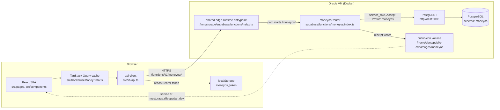
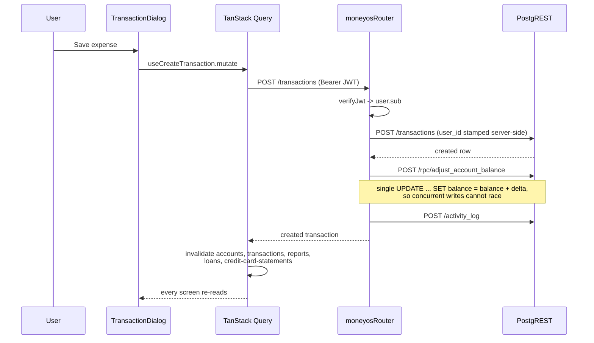
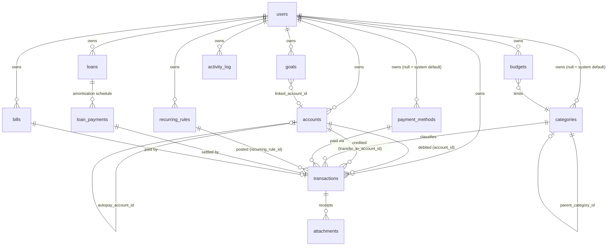

# MoneyOS - Developer Documentation

Technical reference for the MoneyOS codebase: architecture, auth, data model, API surface, theming, environment and deployment. For what the app does from a user's point of view, see [README.md](./README.md).

## Table of contents

- [Tech stack](#tech-stack)
- [Architecture overview](#architecture-overview)
- [Data model](#data-model)
- [Components and how they work](#components-and-how-they-work)
- [API surface](#api-surface)
- [Auth model](#auth-model)
- [Credit card statement cycles](#credit-card-statement-cycles)
- [Recurring rules and catch-up processing](#recurring-rules-and-catch-up-processing)
- [Editing a loan](#editing-a-loan)
- [Timezone handling](#timezone-handling)
- [Theming](#theming)
- [Frontend structure](#frontend-structure)
- [Backend structure](#backend-structure)
- [Environment variables](#environment-variables)
- [Seed and demo data](#seed-and-demo-data)
- [Local development](#local-development)
- [Testing](#testing)
- [Continuous integration](#continuous-integration)
- [Deployment](#deployment)
- [Security notes](#security-notes)
- [Known constraints and future enhancements](#known-constraints-and-future-enhancements)
- [Documentation](#documentation)
- [Contributors](#contributors)
- [Glossary](#glossary)

## Tech stack

| Layer | Choice | Version | Note |
|---|---|---|---|
| UI | React | 19.2 | |
| Language | TypeScript | 5.9 | Strict; `npx tsc --noEmit` is part of CI |
| Build | Vite | 5.4 | `@vitejs/plugin-react-swc` |
| Styling | Tailwind CSS | 4.3 | v4 has no JS config; tokens live in `src/index.css` |
| Components | Radix UI primitives via shadcn/ui | - | Vendored into `src/components/ui`, regenerable |
| Server state | TanStack Query | 5.101 | 30s `staleTime`, one retry |
| Routing | react-router-dom | 6.30 | |
| Charts | Recharts | 2.15 | |
| Forms | react-hook-form + zod | 7.83 / 3.25 | |
| Toasts | sonner | 1.7 | |
| Icons | lucide-react | 0.462 | |
| Backend runtime | Deno (Supabase edge runtime) | - | Self-hosted, see Deployment |
| Data access | PostgREST over plain `fetch` | - | No `supabase-js`; see below |
| Database | PostgreSQL, `moneyos` schema | - | |
| Password hashing | `npm:bcryptjs@2` | - | |
| Hosting (frontend) | Vercel | - | `vercel.json` rewrites all non-file paths to `index.html` |

Two choices worth justifying.

**No `supabase-js`.** The edge function runs on a memory-constrained shared container (roughly 950Mi across every app on the box). It only ever needs REST calls against PostgREST with a fixed set of headers, so plain `fetch` avoids the bundle weight for no loss of capability.

**No Supabase Auth.** MoneyOS issues its own tokens (see [Auth model](#auth-model)). This matches the sibling projects on the same host and keeps the `moneyos` schema free of any dependency on `auth.users`, so the schema is self-contained and portable.

## Architecture overview



What each box owns:

- **React SPA** owns presentation and nothing else. It never computes a balance, a statement cycle or a report total; those come from the server so that no two screens can disagree.
- **TanStack Query cache** owns freshness. Query keys are resource names (`accounts`, `transactions`, `reports`, `loans`, `credit-card-statements`), and any money-moving mutation invalidates the whole set through `useMoneyMutationInvalidation`.
- **api client** owns transport: base URL, the `Authorization` header, and turning a 401 into a cleared token plus a readable error. Nothing else in the frontend calls `fetch`.
- **moneyosRouter** owns authorisation and all money arithmetic. It is the only thing that holds the service-role key.
- **PostgREST** owns nothing but table access. Every request from the router already carries the ownership filter.
- **PostgreSQL** owns constraints, indexes and the one atomic balance function.

### The core write path



Balances are maintained by the edge function rather than a database trigger. Balance arithmetic, group-expense derivation and card settlement logic then live in one auditable place instead of being split between application code and triggers.

## Data model

Thirteen tables in the `moneyos` schema, plus nine enums.



### Conventions that apply everywhere

- **Ownership.** Every user-owned table has `user_id uuid not null references moneyos.users(id) on delete cascade`. The two exceptions are `categories` and `payment_methods`, where `user_id null` means a shared system default visible to everyone.
- **Money.** `numeric(14,2)` throughout. Never a float.
- **Timezone.** `occurred_at` is `timestamptz` (an absolute instant). Everything else that represents a calendar day is `date`: `due_date`, `start_date`, `end_date`, `next_run_date`, `last_run_date`, `last_posted_period`, `paid_date`, `last_settled_statement`. Dates are never converted; instants always are. See [Timezone handling](#timezone-handling).
- **Signed balances.** `accounts.current_balance` is signed. A credit card starts at 0 and goes negative as it is used. There is no separate "owed" column; owed is `max(0, -current_balance)`.

### Key tables

**users** - replaces `auth.users` entirely. `email` and `username` are both unique; either can be used to sign in. `password_hash` is bcrypt cost 10. `is_active` gates login.

**accounts** - `type` is one of `cash, bank, card, upi, wallet, savings, credit`. Credit-card-only columns: `credit_limit`, `statement_day` (1-28), `due_day` (1-28), `autopay_enabled`, `autopay_account_id`, `autopay_last_run`, `last_settled_statement`. The 1-28 bound avoids month-length edge cases entirely.

**transactions** - the ledger. `amount` is always what actually hit the account, and is `check (amount >= 0)`; direction comes from `type`, not from sign. For a group expense that means your share only, with `group_total_amount`, `group_participant_count` and `group_reason` kept alongside for reporting. `transfer_to_account_id` is set only when `type = 'transfer'`. Indexed on `(user_id, occurred_at desc)`, `(user_id, category_id)` and `(user_id, account_id)`.

**loan_payments** - one row per instalment, `unique (loan_id, installment_number)`. `remaining_balance` is the principal left after that instalment, which is what an edit uses to re-anchor the schedule. `transaction_id` links to the payment that settled it.

**recurring_rules** - `next_run_date` is the cycle currently owed. `last_run_date` is when the catch-up pass last acted. `last_posted_period` is which cycle was last settled; the three are genuinely different and all three are needed. Partial index on `(user_id, next_run_date) where is_active`.

**activity_log** - append-only audit trail. Currently written only on transaction creation.

### Functions

`moneyos.adjust_account_balance(p_account_id uuid, p_delta numeric) returns numeric` - a single `UPDATE ... SET current_balance = current_balance + p_delta` called over PostgREST RPC. Read-then-write in application code would race whenever two requests touch the same account.

## Components and how they work

### `src/lib/api.ts`

The only module that calls `fetch`. Exposes one object per resource (`accounts`, `transactions`, `loans`, `budgets`, `goals`, `bills`, `recurringRules`, `categories`, `paymentMethods`, `creditCards`, `reports`, `upload`, `auth`, `processDue`) and the full TypeScript type for every row.

Reads and writes for simple tables go through `/data`, a generic gateway. Anything that affects a balance or a schedule has its own route, because it needs server-side arithmetic. `dataSelect`, `dataInsert`, `dataUpdate` and `dataDelete` are private helpers over the gateway.

A 401 anywhere clears the stored token and throws "Your session has expired", which is what makes an expired session self-heal rather than looping.

### `src/hooks/useMoneyData.ts`

One hook per operation, thin wrappers over `api.ts`. The important piece is `useMoneyMutationInvalidation`, which invalidates `accounts`, `transactions`, `reports`, `loans` and `credit-card-statements` together. Card statements are derived from balances and transactions, so any movement can change what is billed.

### `src/contexts/AuthContext.tsx`

Holds `user` and `loading`. On mount it reads the token, discards it if `decodeToken` says it is malformed or expired, and otherwise calls `/auth/me` to confirm the server still accepts it. `loading` gates the router so a refresh does not flash the login screen.

### `src/lib/upcoming.ts`

Builds one list from four sources: unpaid loan instalments (soonest per loan), unpaid bills, active recurring rules, and card statements with an amount due. The dashboard windows it to 15 days; the notifications bell windows it to 2 and drops auto-posting rules, since those need no action. Both read from here so the two can never disagree.

### `supabase/functions/moneyos/index.ts`

The whole backend, in sections: JSON/CORS helpers, HS256 JWT sign and verify, the PostgREST client, timezone helpers, auth routes, the `/data` gateway, transaction routes, loan routes, recurring routes, credit card statement computation, the catch-up pass, reports, upload, and the router at the bottom.

`moneyosRouter(req, path)` is exported and takes a path already stripped of the `/moneyos` prefix.

## API surface

Base URL: `${VITE_SUPABASE_URL}/functions/v1/moneyos`. Every route except signup and login requires `Authorization: Bearer <jwt>`.

| Method | Path | Purpose |
|---|---|---|
| POST | `/auth/signup` | Create a user, seed a default Cash wallet, return a token |
| POST | `/auth/login` | Exchange username-or-email plus password for a token |
| GET | `/auth/me` | Current profile |
| PATCH | `/auth/me` | Update `display_name`, `avatar_url`, `default_currency` |
| POST | `/data` | Generic gateway, see below |
| GET | `/transactions` | Filter by `from`, `to`, `account_id`, `category_id`, `type`, `search`, `limit` |
| POST | `/transactions` | Create, then apply the balance effect |
| PATCH | `/transactions/:id` | Reverse the old balance effect, apply the new one |
| DELETE | `/transactions/:id` | Reverse the balance effect, clear card settlement markers |
| POST | `/accounts/transfer` | Paired transfer as one transaction |
| POST | `/loans` | Create and generate the amortisation schedule |
| PATCH | `/loans/:id` | Update, regenerating the unpaid tail if the numbers changed |
| GET | `/loans/:id/schedule` | Full instalment list |
| POST | `/loans/:id/payments/:paymentId/pay` | Post the payment transaction, close the loan if it was the last |
| POST | `/recurring_rules/:id/post` | Mark the current cycle paid and advance |
| GET | `/credit-cards/statements` | Per-card cycle summary, needs `tz_offset` |
| POST | `/process-due` | Catch-up pass, needs `tz_offset` |
| GET | `/reports/summary` | Totals, category split, trend, net worth, budgets |
| POST | `/upload` | Receipt image, filename in `x-file-name`, max 10MB |

Errors are `{ "error": "message" }` with the status. A `PostgrestError` propagates its own status; anything else is a 500.

### The `/data` gateway

`POST /data` with `{ table, operation, id, idColumn, payload, filters, order, limit }`.

Allowed tables: `categories`, `payment_methods`, `accounts`, `recurring_rules`, `loans`, `budgets`, `goals`, `bills`, `attachments`. Plus `transactions` and `loan_payments` for `select` only.

Rules the gateway enforces:

- Writes to `transactions` and `loan_payments` are rejected; they must use their own routes so balances and schedules stay correct.
- `update` on `loans` is rejected, for the same reason.
- `update` and `delete` on `categories` and `payment_methods` are rejected when the row is a system default (`is_system` or `user_id is null`).
- `insert` stamps `user_id` from the token; the client cannot choose it.
- `update` and `delete` filter on `user_id` as well as `id`.
- `select` applies the ownership filter **after** client filters, and ignores the reserved keys `or, and, not, select, order, limit, offset, user_id`, so no filter can widen the query beyond its owner.

## Auth model

Hand-rolled, with no dependency on Supabase Auth or GoTrue.

**Sign up.** Email and username are checked for uniqueness with two scoped queries, the password is bcrypt-hashed at cost 10, the user row is inserted, a default "Cash" wallet is created so the dashboard is not empty, and a token is returned. Passwords under 8 characters are rejected.

**Sign in.** The identifier is looked up by `username` first, then by `email` if that found nothing. `is_active` and the bcrypt comparison must both pass. `last_login_at` is stamped.

**The token.** HS256 over `{ sub, username, iat, exp }`, signed with `MONEYOS_JWT_SECRET` through Web Crypto. TTL is 30 days: this is a daily-use personal tool, not a shared workspace, so re-authenticating weekly would be friction without a matching risk reduction.

**Storage.** `localStorage` under `moneyos_token`. Not a cookie, so there is no CSRF surface; the tradeoff is that XSS would expose the token, which is why nothing in the app renders untrusted HTML.

**Verification.** `requireAuth` runs on every route except signup and login, before any handler. `decodeToken` in the browser reads the payload for UI state only and never verifies the signature.

**Expiry.** No refresh tokens. On expiry the next request returns 401, the client clears the token and shows the login screen.

**Roles.** There are none. Every user owns their own data and there is no cross-user access of any kind.

### Row Level Security

Every table has RLS enabled and **zero policies**, which denies all access to `anon` and `authenticated`. Only the service-role connection reaches the data, and that is the edge function alone.

The `GRANT`s in `0002_rls_policies.sql` are deliberately broad because Postgres checks grants before RLS runs; without them PostgREST returns `42501` regardless of policy. The grants let a request reach the RLS stage, where it is then denied.

This means RLS is defence in depth, not the authorisation model. All ownership enforcement is in the edge function. If any table turns out to be reachable with the anon key, that is a bug.

## Credit card statement cycles

The part of the system with the most subtlety, in `summarizeCard` and `statementDatesFor`.

A card has two days, not one:

- **statement_day** closes a cycle. Everything from the day after the previous statement day up to and including this one is the statement.
- **due_day** is when that closed statement must be paid.

Spend after the statement day is unbilled and belongs to the next cycle, even while the current bill is outstanding. Modelling this as a single balance due on one day demands post-statement purchases up to a fortnight early.

The arithmetic:

```
balanceAtStatement = currentBalance - (paidSince - spentSince)
statementBalance   = max(0, -balanceAtStatement)
amountDue          = max(0, statementBalance - paidSince)
leftoverPayment    = max(0, paidSince - statementBalance)
unbilledSpend      = max(0, spentSince - leftoverPayment)
```

Payments made after the statement closed pay down the statement first; only what is left over counts against post-statement spend.

Two details:

- On the statement day itself the cycle is still open. It closes at end of day, so only a later date sees this month's statement.
- A due day after the statement day falls in the same month; a due day on or before it means the bill is due the following month. That two-month span is why `last_settled_statement` is keyed by the statement's close date rather than by calendar month.

Cards with no `statement_day` fall back to treating the entire outstanding balance as billed.

`loadStatementCycles` fetches transactions for every card in one query, from the earliest cycle start any of them needs, rather than one query per card.

## Recurring rules and catch-up processing

There is no scheduler on the host, so `POST /process-due` runs once per app load from `AppShell`. It does two things.

**Auto-posting rules.** Every active rule with `auto_post` and `next_run_date <= today` posts a transaction and advances by one interval, looping until it catches up. Iteration is capped at 24 per rule, so a rule left unvisited for years cannot generate an unbounded backlog in one pass. A rule past its `end_date` is deactivated.

**Autopay.** For each autopay-enabled card whose statement is due today or earlier, and whose `last_settled_statement` is not already this statement, a transfer of `amount_due` is posted from `autopay_account_id`, and both markers are stamped.

Manual settlement uses `POST /recurring_rules/:id/post`, which carries the `period` the client believed was due. If the rule has already advanced past it the server returns 409 rather than posting the next cycle too, which is what makes a double click safe.

Deleting or editing a transfer into a credit card clears that card's settlement markers, because it may have undone what autopay recorded as settled.

## Editing a loan

`SCHEDULE_AFFECTING_FIELDS` is `principal_amount, interest_rate, tenure_months, emi_amount, start_date`. Changing anything else is metadata and leaves the schedule alone.

When one of those changes:

1. Paid instalments are left exactly as they were. Their transactions already happened.
2. Unpaid instalments are deleted and regenerated from the principal remaining after the last paid one (`remaining_balance`), for `tenure_months - paid.length` instalments.
3. The regenerated schedule is anchored to the last paid instalment's due date, not to `start_date`.
4. Because of that anchoring, `start_date` is dropped from the patch once anything is paid; accepting it would leave a value that misrepresents the real schedule. The UI disables the field to match.
5. A new tenure leaving zero instalments after what is paid is rejected with a 400.
6. A closed loan whose tenure was extended is reopened.

The last instalment is forced to close the principal exactly, absorbing rounding drift.

## Timezone handling

The server runs on UTC. Every "today", "this month" and "this statement cycle" is a calendar date in the **user's** zone. `occurred_at` is an absolute instant. Reconciling those is explicit:

- The client sends `tz_offset` in minutes east of UTC (`-new Date().getTimezoneOffset()`, 330 for IST) on every date-bucketed request.
- `localDate(instant, offset)` gives the calendar date an instant falls on for that user.
- `instantFromLocal(date, offset, 'start' | 'end')` gives the absolute bounds of a local calendar day.

Report ranges are converted to instants before querying. Comparing a `timestamptz` against a bare local-looking string resolves in the container's zone and pushes early-morning spend out of the range.

On the client, `parseDateLike` in `src/lib/format.ts` parses a bare `YYYY-MM-DD` as local midnight. `new Date('2026-08-05')` is UTC midnight and renders as the 4th anywhere west of Greenwich.

## Theming

Tailwind v4, so there is no `tailwind.config.js`. Everything is in `src/index.css`:

- `@custom-variant dark (&:is(.dark *))` makes `dark:` a class-based variant. `ThemeProvider` puts `light` or `dark` on `<html>`.
- `@theme inline { --color-*: hsl(var(--*)) }` maps Tailwind colour utilities onto CSS custom properties.
- `@layer base { :root { ... } .dark { ... } }` defines those properties as bare `H S% L%` triples for both modes.

`ThemeContext` then overrides `--primary`, `--ring` and `--accent` inline on `document.documentElement`, picking the dark or light variant of the palette depending on whether `.dark` is set. The values in `index.css` are the initial paint before the context applies its own.

Six palettes (`emerald`, `ocean`, `sunset`, `violet`, `rose`, `slate`) plus `custom`. Each defines `primary`, `accent`, `darkPrimary` and `darkAccent`, since a colour readable on white is rarely readable on near-black. A custom palette derives its dark variants by lifting lightness to 62% and 58%.

Preferences persist in `localStorage`: `moneyos-theme`, `moneyos-palette`, `moneyos-custom-primary`, `moneyos-custom-accent`. Mode falls back to `prefers-color-scheme`.

**To add a colour:** add the custom property to both `:root` and `.dark` in `index.css`, then map it in the `@theme inline` block. Adding it to only one mode is the usual mistake.

The brand mark uses `.logo-mono`, a filter that flattens it to black in light mode and white in dark, so one file serves both.

## Frontend structure

```
src/
  App.tsx                     Router, providers, the RequireAuth gate
  main.tsx                    Mount point
  index.css                   Tailwind v4 config, design tokens, both themes
  assets/                     Brand mark
  components/
    layout/                   AppShell (nav, quick-add), NotificationsBell
    skeletons/                Per-page and primitive loading states
    transactions/             TransactionDialog, QuickAddButton
    ui/                       Vendored shadcn/ui - regenerable, do not hand-edit
  contexts/                   AuthContext, ThemeContext
  hooks/                      useMoneyData (all queries), useDismissedReminders
  lib/                        api, authToken, format, upcoming, utils
  pages/                      One file per route
supabase/
  functions/moneyos/          The backend
  migrations/                 Ordered SQL, 0001 to 0006
docs/
  assets/                     README logo
  screenshots/                dark/, light/, responsive/dark/, responsive/light/
  COMMENT_STYLE.md            Doc comment convention
scripts/
  seed-demo.mjs               Demo data seeder
  build-light-readme.mjs      Generates README-light.md from README.md
```

Routes, all under `RequireAuth` except `/auth`:

| Path | Page |
|---|---|
| `/auth` | Sign in and sign up |
| `/` | Dashboard |
| `/transactions` | Transactions |
| `/accounts` | Accounts |
| `/budgets` | Budgets |
| `/goals` | Goals |
| `/loans` | EMIs and Bills (three tabs) |
| `/reports` | Reports |
| `/settings` | Settings |
| `*` | Redirect to `/` |

Conventions: `@/` aliases `src/`. Page components are default exports; everything else is named. Dialogs live beside the page that opens them unless shared. Loading states are dedicated skeleton components, not spinners.

## Backend structure

One file, `supabase/functions/moneyos/index.ts`, in this order:

| Section | Contents |
|---|---|
| Environment | `POSTGREST_URL`, `SERVICE_ROLE_KEY`, `MONEYOS_JWT_SECRET`, schema name, token TTL |
| JSON and CORS | `json()`, `moneyosCorsHeaders()` |
| JWT | base64url helpers, `signJwt`, `verifyJwt`, `requireAuth` |
| PostgREST client | `pg()`, `qs()`, `PostgrestError` |
| Timezone helpers | `tzOffsetOf`, `localDate`, `instantFromLocal`, `shiftDays`, `shiftMonths`, `withDayOfMonth` |
| Auth routes | signup, login, me |
| Data gateway | `handleData` and its allow-lists |
| Transactions | `applyBalanceEffect`, create, update, delete, list, transfer |
| Loans | `generateAmortizationSchedule`, create, update, schedule, pay |
| Recurring | `advanceDate`, `cyclePeriodLabel`, post, `handleProcessDue` |
| Credit cards | `statementDatesFor`, `cardDelta`, `summarizeCard`, `loadStatementCycles` |
| Reports | `rangeToDates`, `buildTrend`, `handleReportsSummary` |
| Upload | `handleUpload` |
| Router | `moneyosRouter` |

`pg()` sets `apikey` and `Authorization` to the service-role key and `Accept-Profile`/`Content-Profile` to `moneyos`, so PostgREST resolves the non-public schema. `single: true` adds the `vnd.pgrst.object+json` accept header.

Error handling is one try/catch around the router. Everything else throws.

## Environment variables

### Frontend, at build time

| Name | Required | Default | Purpose |
|---|---|---|---|
| `VITE_SUPABASE_URL` | yes | none | Base URL of the Supabase host. The API base is this plus `/functions/v1/moneyos`. Public: it is baked into the bundle. |

### Backend, in the edge runtime

| Name | Required | Default | Purpose |
|---|---|---|---|
| `POSTGREST_URL` | no | `http://rest:3000` | PostgREST on the internal Docker network |
| `SERVICE_ROLE_KEY` | yes | `""` | Bypasses RLS. Never leaves the container. |
| `MONEYOS_JWT_SECRET` | yes | `""` | HS256 signing key. Rotating it invalidates every session. |

`.env.example` is the source of truth for the frontend and is checked against this table in review. Neither backend secret has a safe default: an empty `MONEYOS_JWT_SECRET` would sign every token with an empty key, so both must be set in the host environment.

## Seed and demo data

### System defaults

`0003_seed_system_defaults.sql` inserts rows with `user_id null`, visible to every user: 15 expense categories, 7 income categories, and a set of payment methods (Cash, UPI apps, cards, bank transfer). They cannot be renamed or deleted through the API.

### Demo account

`scripts/seed-demo.mjs`, wired to `npm run seed:demo`.

```bash
npm run seed:demo
npm run seed:demo -- --username demo --password 'DemoPass123!' --url https://your-host
```

Register the account through the app's own sign-up form first; the script only fills it. Credentials:

| Role | Username | Email | Password |
|---|---|---|---|
| Standard user | `demo` | `demo@example.com` | `DemoPass123!` |

What it creates:

| Entity | Count | Coverage |
|---|---|---|
| Accounts | 5 | cash, savings, bank, UPI wallet, credit card with statement day 18 and due day 5, autopay on |
| Transactions | 38 | four months, expense/income/transfer, tagged, uncategorised, one very long description |
| Group expenses | 3 | with total and headcount, so Group spend is non-zero |
| Transfers | 3 | including a part payment into the card |
| Loans | 2 | one with interest and four instalments paid, one 0% |
| Subscriptions | 7 | monthly, weekly, yearly, three autopaying, one paused |
| Bill reminders | 5 | one overdue, one already settled |
| Budgets | 5 | one deliberately over its limit |
| Goals | 4 | one completed |

Two guards: it refuses any username outside `demo`, `demo2`, `admin`, and every entity is looked up by name first, so it is idempotent.

**Reset:** delete the demo user row. Every table cascades from `users`.

## Local development

Prerequisites: Node 20.19 or newer (22 in CI), npm, and a reachable backend.

```bash
npm install
cp .env.example .env      # set VITE_SUPABASE_URL
npm run dev               # http://localhost:5173
```

| Command | Does |
|---|---|
| `npm run dev` | Vite dev server |
| `npm run build` | Production build to `dist/` |
| `npm run preview` | Serve the built output |
| `npm run lint` | ESLint |
| `npx tsc --noEmit` | Typecheck |
| `npm run seed:demo` | Fill the demo account |

Pointing at the shared host is the fastest path and is what the demo account is for. To run the backend yourself you need Postgres with the migrations applied in order, PostgREST configured to expose the `moneyos` schema, and a Deno edge runtime serving `moneyosRouter` under `/moneyos/*`. The edge function is not deployable with `supabase functions deploy`; see [Deployment](#deployment).

## Testing

There is no automated test suite. This is a deliberate gap, not an oversight, and it is the first thing on the enhancements list below.

What CI does instead: lint, typecheck, a production build, and a parse check on the edge function. That catches syntax and type regressions but nothing behavioural.

The logic that most needs tests, in order: `summarizeCard` and `statementDatesFor`, `generateAmortizationSchedule` and the regeneration path in `handleUpdateLoan`, the timezone helpers, and `handleProcessDue`. All four are pure or near-pure and would be cheap to cover.

## Continuous integration

`.github/workflows/ci.yml`, on push and PR to `master`/`main`.

**build** - `npm ci`, lint, `tsc --noEmit`, `npm run build` with a placeholder `VITE_SUPABASE_URL`, then a TypeScript parse check on the edge function (which the app's `tsconfig` does not cover, since it is Deno).

**audit** - `npm audit --omit=dev`, advisory only, but fails on any **critical** advisory. A new moderate advisory upstream should not turn every PR red; a critical one should.

Failing lint or a type error fails the build job. Warnings do not.

## Deployment

### Frontend

Vercel, from the repository. Build `npm run build`, output `dist/`. `vercel.json` rewrites every path without a file extension to `/index.html`, which is what a client-routed SPA needs so a deep link does not 404.

`VITE_SUPABASE_URL` must be set in the Vercel project. It is compiled into the bundle, so changing it needs a rebuild, not just a restart.

### Backend

**This is not a normal Supabase function deploy.** The host runs the edge runtime in single main-service mode:

```
command: start --main-service /home/deno/functions
```

One `index.ts` at `/mnt/storage/supabase/functions/index.ts` handles every `/functions/v1/*` request for every app on the box. There is no per-directory function deploy as on Supabase Cloud.

So `supabase/functions/moneyos/index.ts` is the source of truth for MoneyOS's logic, and it is spliced into that shared entrypoint behind:

```ts
if (url.pathname.startsWith("/moneyos/")) {
  return moneyosRouter(req, url.pathname.replace(/^\/moneyos/, ""));
}
```

The shared file also carries other apps' handlers (design-andhra-pradesh's `/upload` and `/hello`), which must be left untouched.

To deploy a backend change: copy the updated router into the shared entrypoint on the VM, keeping the other apps' branches intact, then restart the edge-runtime container. Confirm `POST /functions/v1/moneyos/auth/login` still returns 400 for an empty body before considering it done.

Receipts are written straight to the shared `public-cdn` volume at `/home/deno/public-cdn/images/moneyos` and served from `https://mystorage.dileepadari.dev/images/moneyos/`.

### Migrations

Applied in filename order against the `moneyos` schema. They have no down migrations; rolling back means restoring from a database backup.

### Rollback

Frontend: redeploy the previous Vercel deployment. Backend: keep a copy of the previous shared entrypoint before overwriting it, and restore that file plus a container restart.

## Security notes

### Fixed

| Issue | Where | Fix |
|---|---|---|
| PostgREST filter injection | `handleSignup`, `handleLogin` | The identifier was interpolated into an `or=(...)` expression, where PostgREST parses commas and parentheses as syntax. A crafted username could widen the filter to match rows it should not. Replaced with two separately scoped queries. |
| Ownership scoping could be displaced | `handleData` select | Client filters were applied after the `or=` ownership clause and could overwrite it. Filters are now applied first, the scoping last, and reserved query keys are ignored. |
| `user_id` was client-settable on update | `handleUpdateTransaction`, `handleUpdateLoan` | Both merged the client patch wholesale into a row patched by `id` alone, so a patched `user_id` would reassign the row to another account. Both now pin `user_id` from the token. |

### Accepted, with reasons

- **`Access-Control-Allow-Origin: *`.** The API authenticates with a bearer token from `localStorage`, never a cookie, so a permissive origin does not let another site act as the user. Worth tightening to the known frontend origins if this ever moves to cookie auth.
- **30-day tokens, no revocation.** Single-user personal tool. There is no session list and no logout-everywhere; signing out clears the local token only. Rotating `MONEYOS_JWT_SECRET` invalidates everything.
- **Token in `localStorage`.** Chosen over a cookie to avoid CSRF entirely. The tradeoff is XSS exposure, which is why no user content is ever rendered as HTML.
- **RLS as defence in depth only.** See [Auth model](#auth-model).

### Verified as not issues

`handleUpload` validates the filename against `^[a-zA-Z0-9._-]+$` (no separators, so no traversal) and prefixes it with the user id. Uploads are capped at 10MB. `amount` is `check (amount >= 0)` in the schema, so direction cannot be flipped by a negative value.

## Known constraints and future enhancements

### Constraints

- **No tests.** The largest gap. See [Testing](#testing).
- **Catch-up runs on app load, not on a schedule.** Nothing posts while the app is closed. Open it after a month away and everything settles at once, correctly dated but all recorded then. A real cron on the host would fix this.
- **One shared edge-runtime entrypoint.** Backend deploys are a manual splice into a file shared with other apps, which is error-prone and cannot be automated from this repository as it stands.
- **`statement_day` and `due_day` are limited to 1-28.** Avoids month-length edge cases, but cannot represent a card that bills on the 30th.
- **Single currency per profile.** `currency` exists per account and per transaction, but nothing converts between them; a mixed-currency account list would produce a meaningless total.
- **No pagination.** Transaction lists are capped by `limit` and load in one request. Fine at a few thousand rows, not at fifty thousand.
- **Bundle is 965KB before gzip, 277KB after.** Everything is in one chunk; Recharts and framer-motion dominate.
- **The dashboard stat tiles overflow between 768px and roughly 900px.** The grid is `grid-cols-2 md:grid-cols-4`, so at the `md` breakpoint four tiles share the width and a seven-figure rupee amount is clipped. Visible in the tablet screenshot. The fix is an `lg:grid-cols-4` step, leaving two columns through the tablet range.
- **Goals are manual.** A contribution does not move money between accounts, so a goal can claim savings the balances do not have.
- **`activity_log` is barely used.** Written only on transaction creation and never read.
- **No account deletion.** There is no route to delete a user or export-then-erase.

### Enhancements, roughly in order

1. Unit tests for statement cycles, amortisation and the timezone helpers.
2. A real scheduler for `process-due`, so obligations post whether or not the app is open.
3. Route-level code splitting to cut the initial bundle.
4. Pagination or infinite scroll on transactions.
5. A deploy script for the shared entrypoint that splices the router in mechanically instead of by hand.
6. Cross-account goal contributions that actually move money.
7. CSV import, to make switching to MoneyOS possible without retyping history.
8. Multi-currency with stored conversion rates.
9. Read the `activity_log` into a visible history, or drop the table.

## Documentation

`README.md` and `README-light.md` are the same page in two themes. GitHub has no theme
toggle, so the toggle is a pair of files linking to each other, each using one screenshot
set. Only `README.md` is edited by hand:

```bash
npm run docs:readme-light   # regenerates README-light.md from README.md
```

The script fails loudly if a marker it rewrites has gone missing, so the two cannot
silently drift. Screenshots live under `docs/screenshots/<theme>/` with identical
filenames in both, which is what makes the substitution safe.

## Contributors

| Person | Owns |
|---|---|
| [Dileep Adari](https://github.com/Dileepadari) | Everything: schema, edge function, frontend, deployment |

## Glossary

| Term | Meaning |
|---|---|
| **Statement day** | The day a card's billing cycle closes |
| **Due day** | The day the closed statement must be paid |
| **Billed / statement balance** | What the closed cycle demands |
| **Unbilled spend** | Charged since the statement closed; owed next cycle |
| **Cycle** | One period of a recurring rule, named by the `next_run_date` it consumed |
| **Period** | The cycle a posted transaction settled, as in "paid for August" |
| **Catch-up pass** | `POST /process-due`, standing in for a scheduler |
| **System default** | A category or payment method with `user_id null`, shared by all users |
| **Group expense** | A transaction recording your share, with the full bill kept alongside |
| **EMI** | Equated Monthly Instalment, one row of an amortisation schedule |
| **Net worth** | Balances minus outstanding loan principal |

---

Minor and local implementation notes that do not belong in this document are kept in [not_for_you.md](./not_for_you.md).
