<!-- Generated from README.md by scripts/build-light-readme.mjs. Do not edit by hand. -->

<div align="center">

<picture>
  <source media="(prefers-color-scheme: dark)" srcset="./docs/assets/adk_dev_logo_light.png">
  
</picture>

# MoneyOS

**A personal finance manager for how money actually moves in India: UPI wallets, credit card statement cycles, EMIs, and bills you split with friends.**


<br>


<br><br>

**[Developer documentation](./DEVDOC.md)** · [Features](#features) · [Getting started](#getting-started)

<p><b>Light mode</b> · <a href="./README.md">View this page in dark mode</a></p>

</div>

---

## Contents

- [Why this project matters](#why-this-project-matters)
- [Where it came from](#where-it-came-from)
- [Screenshots](#screenshots)
- [Responsive layout](#responsive-layout)
- [Features](#features)
- [Getting started](#getting-started)
- [Contributors](#contributors)
- [Contributing](#contributing)
- [License](#license)

---

## Why this project matters

Most expense trackers assume money is a single pile that goes down when you spend. Real money is not shaped like that. It sits across a bank account, a salary account, a UPI wallet and a credit card, and each of those behaves differently. Spending on a card does not reduce what you can spend today; it creates an obligation with its own due date, weeks away.

That gap is where budgeting apps quietly mislead you. Bill the whole outstanding card balance on one day and a purchase made the day after the statement closed gets demanded a fortnight early. Sum the card balance into "total balance" and a single swipe looks like cash leaving your pocket. Drop uncategorised spend from the category chart and the chart no longer adds up to the total printed above it. MoneyOS is built around getting exactly these cases right.

It also handles the obligations that arrive without you doing anything: an EMI instalment, a subscription renewal, an autopaid card statement. Those are tracked with real amortisation schedules and real statement cycles, so "what do I owe in the next 15 days" is a question the dashboard can answer honestly instead of approximately.

## Where it came from

Two things the author kept hitting, both visible in how the app is built:

**Credit cards were always wrong.** Every tracker treated a card as one balance with one due date. A real card has two dates: the statement day that closes a cycle, and the due day by which that closed cycle must be paid. Anything swiped after the statement closes belongs to next month's bill, however large it already is. MoneyOS models both dates, and the accounts screen shows the split directly: what is billed, and what is not yet billed.

**Splitting a bill broke the numbers.** Paying ₹5,800 for a group dinner and getting ₹4,350 back is not ₹5,800 of spending. The ledger records what actually left your account, and keeps the group total and headcount alongside it, so reports can say both "you spent ₹1,450" and "you fronted ₹14,240 across group hangouts this year".

<!-- TODO: inspiration - if there is a specific story behind starting this (a month the numbers did not add up, a card bill that surprised you), it belongs here. Ask before writing one. -->

## Screenshots

Every image is a real 1440x900 viewport render of the app with the demo account seeded. This page shows **light mode**; the same gallery in dark mode is at **[README.md](./README.md)**.

<table>
  <tr>
    <td width="33%" valign="top">
      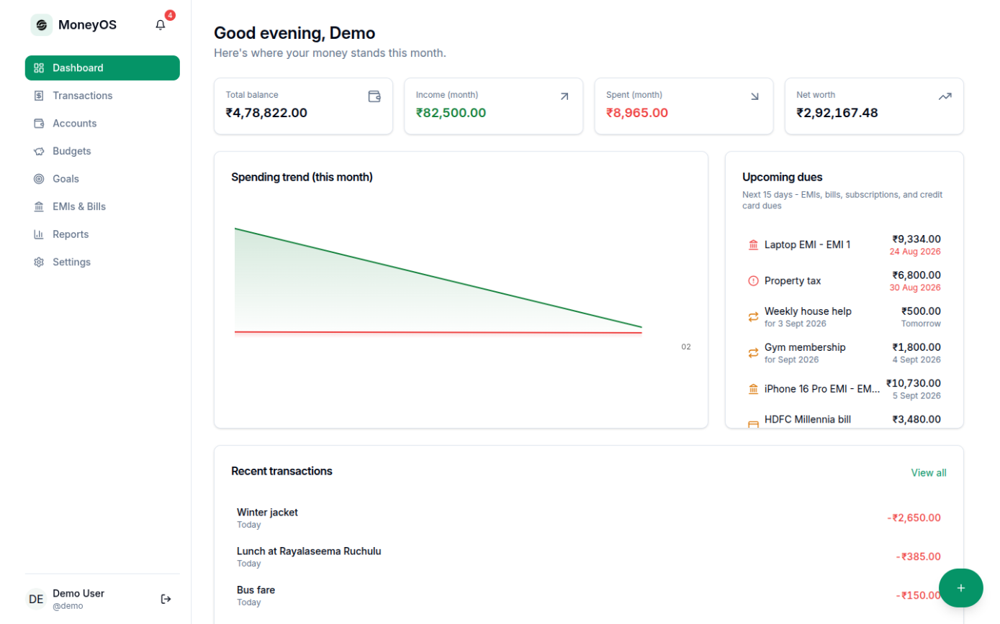
      <p align="center"><b>Dashboard</b><br><sub>Balances, this month's trend, and everything due in the next 15 days.</sub></p>
    </td>
    <td width="33%" valign="top">
      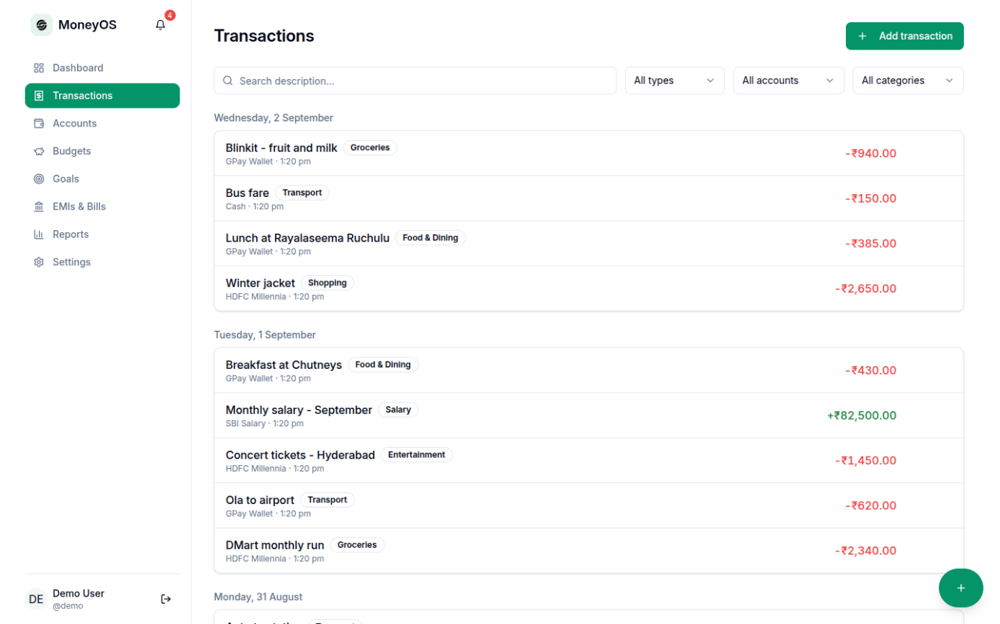
      <p align="center"><b>Transactions</b><br><sub>The full ledger, grouped by day, searchable and filterable.</sub></p>
    </td>
    <td width="33%" valign="top">
      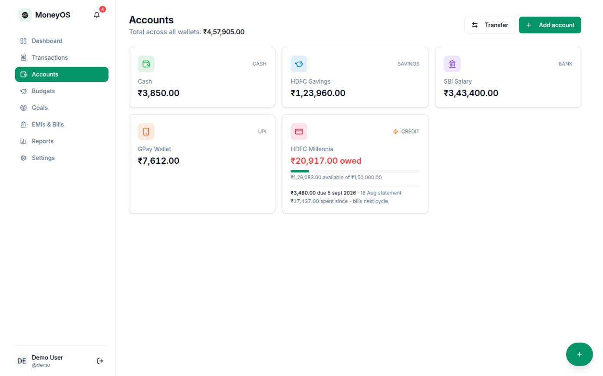
      <p align="center"><b>Accounts</b><br><sub>Wallets and cards, with billed and unbilled split out per card.</sub></p>
    </td>
  </tr>
  <tr>
    <td width="33%" valign="top">
      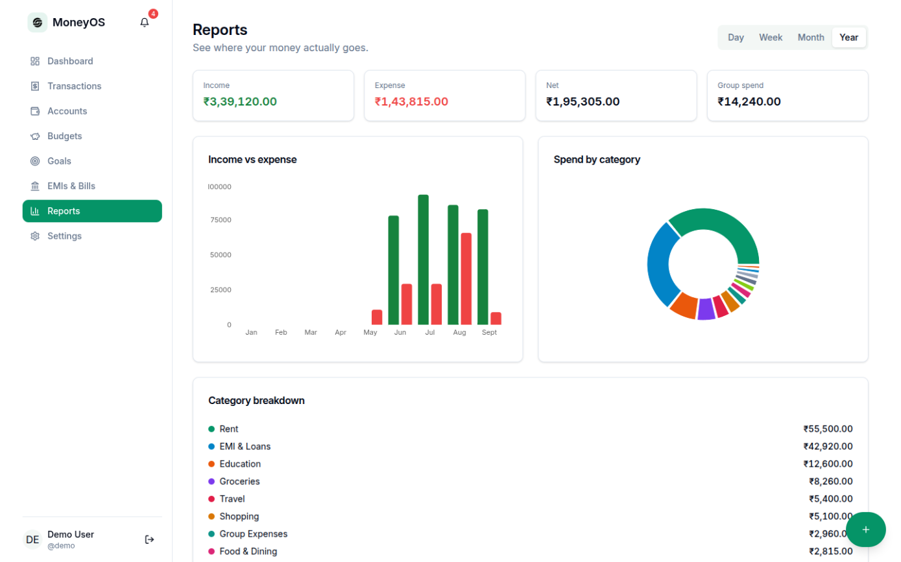
      <p align="center"><b>Reports</b><br><sub>Income against expense and spend by category, over any range.</sub></p>
    </td>
    <td width="33%" valign="top">
      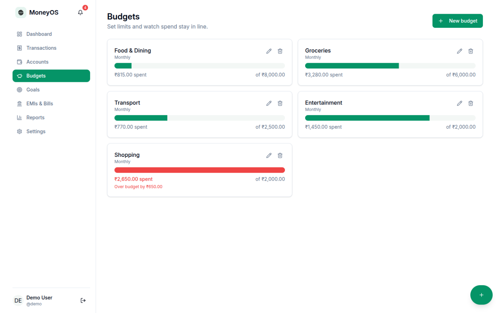
      <p align="center"><b>Budgets</b><br><sub>Per-category limits, with overspend called out rather than clipped.</sub></p>
    </td>
    <td width="33%" valign="top">
      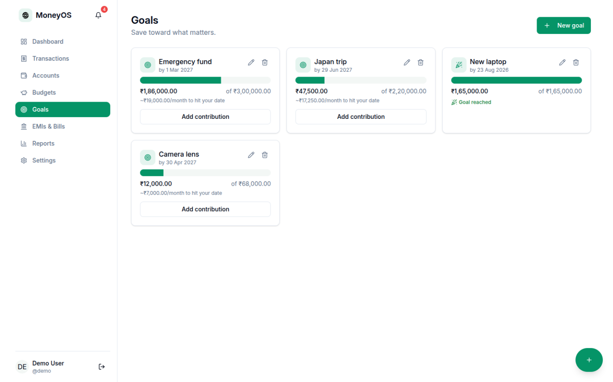
      <p align="center"><b>Goals</b><br><sub>Targets, progress, and the monthly rate needed to hit the date.</sub></p>
    </td>
  </tr>
  <tr>
    <td width="33%" valign="top">
      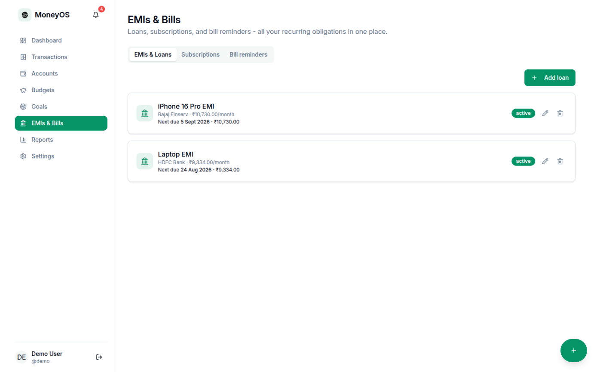
      <p align="center"><b>EMIs and loans</b><br><sub>Full amortisation schedules, with the next instalment on the card.</sub></p>
    </td>
    <td width="33%" valign="top">
      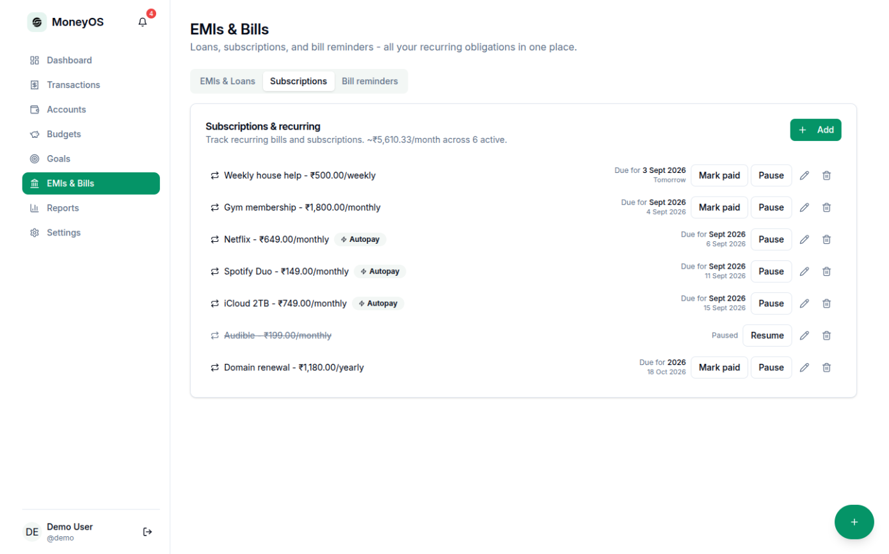
      <p align="center"><b>Subscriptions</b><br><sub>Recurring spend, with autopay handled and pausing supported.</sub></p>
    </td>
    <td width="33%" valign="top">
      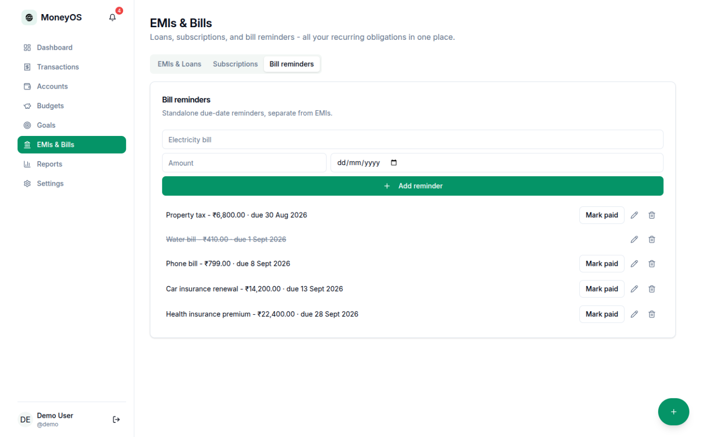
      <p align="center"><b>Bill reminders</b><br><sub>One-off dues that are not subscriptions and not EMIs.</sub></p>
    </td>
  </tr>
</table>

<details>
<summary><b>Settings</b></summary>
<br>
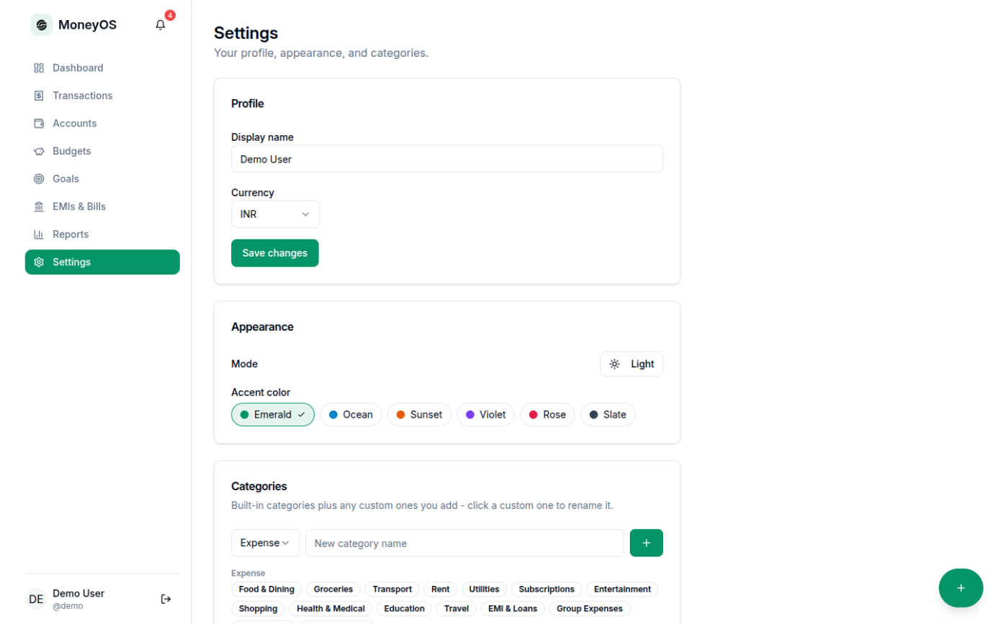
</details>

## Responsive layout

Each image is its own device viewport, not a crop of the desktop layout. The sidebar collapses into a sheet, stat tiles stack two-up, and the quick-add button stays within thumb reach.

<table>
  <tr>
    <td width="20%" valign="top">
      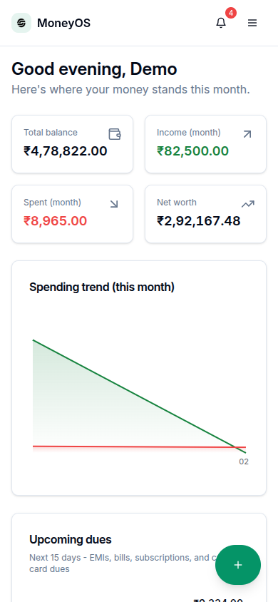
      <p align="center"><sub><b>Dashboard</b><br>390 x 844</sub></p>
    </td>
    <td width="20%" valign="top">
      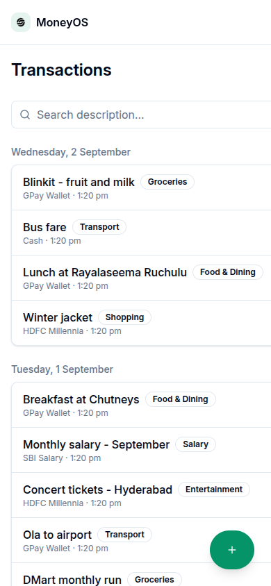
      <p align="center"><sub><b>Transactions</b><br>390 x 844</sub></p>
    </td>
    <td width="20%" valign="top">
      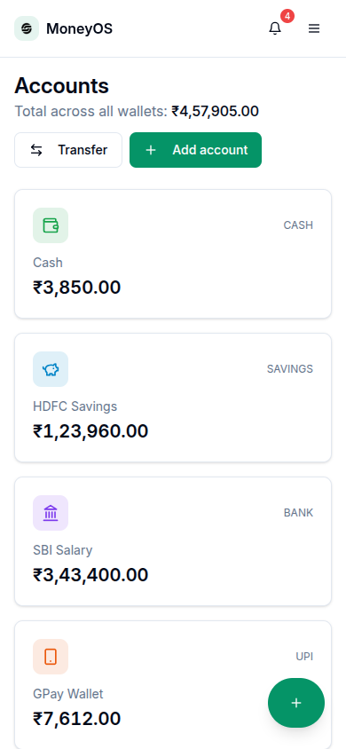
      <p align="center"><sub><b>Accounts</b><br>390 x 844</sub></p>
    </td>
    <td width="40%" valign="top">
      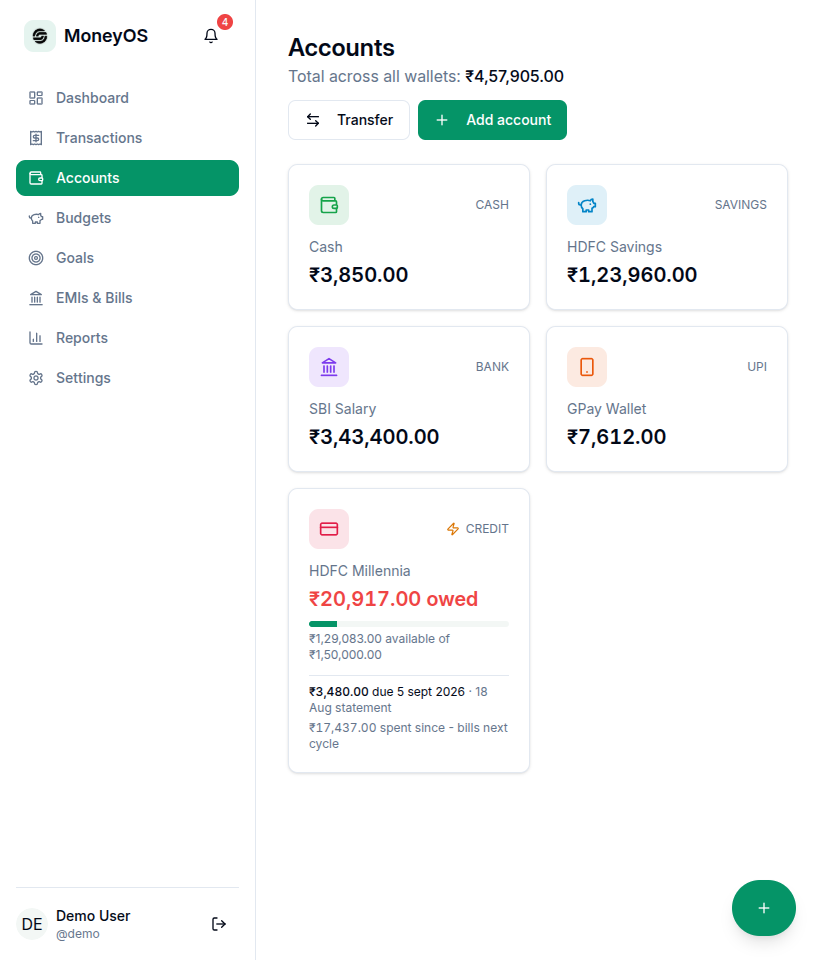
      <p align="center"><sub><b>Accounts</b><br>820 x 960</sub></p>
    </td>
  </tr>
</table>

## Features

**Money in and out**
- Expenses, income and transfers between your own accounts
- Categories, payment methods, free-text tags and notes
- Receipt images attached to a transaction
- Group expenses: record your share while keeping the full bill and headcount

**Accounts**
- Cash, bank, savings, UPI wallet, card and credit card types
- Credit cards with limit, statement day, due day and utilisation
- Autopay a card statement from another account
- Balance correction without inventing a fake transaction
- Archive an account you have stopped using

**Obligations**
- Loans and EMIs with a generated amortisation schedule
- Subscriptions and recurring bills, optionally auto-posting
- Standalone bill reminders
- One merged "upcoming dues" view across all three

**Planning and insight**
- Monthly budgets per category, with overspend surfaced
- Savings goals with a required monthly contribution
- Reports by day, week, month, year or a custom range
- Net worth that counts outstanding loan principal against balances

**The app itself**
- Light and dark mode plus six accent palettes and a custom colour
- Currency choice per profile
- CSV and JSON export of your data
- Works offline-free: no data leaves your own backend

---

### Logging a transaction

The green **+** button is on every screen. Pick **Expense**, **Income** or **Transfer** at the top of the dialog; the fields change to match, so a transfer asks for a destination account and an expense asks for a category.

Amount and account are the only required fields. Everything else is there when you want it: payment method, tags, notes, a date and time other than now, and a receipt image.

The dialog will not close on a stray backdrop click or Escape press. Forms worth losing are not lost.

### Splitting a bill with friends

In the transaction dialog, turn on **Group expense**. Enter what the whole bill came to and how many people shared it, then put your own share in the amount field.

The ledger records only your share, because that is what left your account. The full total and headcount are kept alongside it, so the reports page can show a separate **Group spend** figure. Without this, fronting a ₹5,800 dinner would look like ₹5,800 of your own spending.

### Setting up a credit card

Add an account of type **Credit card**, then fill in three things:

| Field | What it means |
|---|---|
| Credit limit | Drives the utilisation bar |
| Statement (billing) day | The day the cycle closes, 1 to 28 |
| Payment due day | The day that closed cycle must be paid, 1 to 28 |

The accounts page then shows two separate numbers: what the closed statement demands by its due date, and what has been swiped since it closed. The second is not owed yet, however large it looks.

Turn on **Autopay the bill** and pick an account to pay from. On the due date the statement amount is transferred automatically. It pays the statement, not the whole balance, so post-statement spend stays on the card for the next cycle.

Leave the statement day blank and the card falls back to treating the entire outstanding balance as billed.

### Tracking a loan or EMI

**EMIs and Bills → EMIs and Loans → Add loan.** Enter the principal, annual rate, tenure and the account it debits. **Suggest** computes the standard EMI from those numbers if you do not have the figure to hand.

Saving generates the full instalment schedule. Expand a loan to see it, and **Mark paid** on an instalment records a real transaction against the debiting account and closes the loan once nothing is left.

Editing the numbers later recalculates only the instalments that are not paid yet. Already-paid ones keep their amounts, because those payments actually happened. Once anything is paid, the start date locks: the schedule is anchored to the last paid instalment from then on.

### Subscriptions and bill reminders

Both live under **EMIs and Bills**, and they answer different questions.

A **subscription** repeats on a schedule: daily, weekly, monthly or yearly. Turn on autopay and it posts itself when due. Leave it off and use **Mark paid**, which posts one transaction for the current cycle and moves the schedule on by one interval. Pause one you have stopped using without losing its history.

A **bill reminder** is a single dated amount, for something that does not repeat on a fixed schedule: an insurance renewal, a property tax demand.

Both feed the dashboard's upcoming dues and the notifications bell. The bell shows only what needs you to act, so autopaying subscriptions are left out of it; the dashboard still lists them, being a full picture rather than a to-do list.

### Budgets

**Budgets → New budget.** Pick a category and a monthly limit. Progress is measured against the calendar month, and going over is shown in red with the overspend amount rather than a bar quietly stopping at 100%.

### Goals

**Goals → New goal.** Give it a target amount and optionally a target date. MoneyOS shows the monthly contribution needed to hit that date. **Add contribution** moves the goal forward.

### Reading the reports

**Reports** covers day, week, month, year or a custom range. Four tiles across the top, then income against expense over time and spend by category, then budget against actual.

Two things to know. Uncategorised spend gets its own bucket rather than being dropped, so the category chart adds up to the expense total above it. And **Net worth** subtracts outstanding loan principal from your balances, so paying an EMI does not change it: cash goes down, debt goes down with it.

### Theming

**Settings → Appearance.** Light or dark, six accent palettes, and a custom colour if none fit. The choice is stored per device.

### Exporting your data

**Settings → Export.** CSV for a spreadsheet, JSON for anything else. Your data is yours and it is not locked in.

## Getting started

You need Node 20.19 or newer and a backend to point at. For the full setup, including running the database and edge function yourself, see **[DEVDOC.md](./DEVDOC.md)**.

```bash
git clone https://github.com/delhiprojects000/MoneyOs.git
cd MoneyOs
npm install
cp .env.example .env      # then set VITE_SUPABASE_URL
npm run dev               # http://localhost:5173
```

### Demo account

`npm run seed:demo` fills a demo account with four months of realistic data: five accounts including a credit card mid-cycle, 38 transactions, two loans, seven subscriptions, five bill reminders, five budgets and four goals. That is the exact state every screenshot above was taken in.

| Field | Value |
|---|---|
| Username | `demo` |
| Password | `DemoPass123!` |

The seed script refuses to run against any account other than the demo ones, so it cannot touch real data.

## Contributors

<table>
  <tr>
    <td align="center" width="150">
      <a href="https://github.com/Dileepadari">
        
        <br>
        <sub><b>Dileep Adari</b></sub>
      </a>
      <br>
      <sub>Author and maintainer</sub>
    </td>
  </tr>
</table>

Sole author to date. If that changes, add a cell here and a line in DEVDOC's contributors section saying which part of the codebase someone owns.

## Contributing

Issues and pull requests are welcome on [the repository](https://github.com/delhiprojects000/MoneyOs).

Before opening a PR, run what CI runs:

```bash
npm run lint
npx tsc --noEmit
npm run build
```

Conventions: branch off `master`, single-line commit messages, no em dashes anywhere, and update `DEVDOC.md` in the same change if you add an environment variable, a table, an endpoint or a user-facing feature. A feature that leaves the docs stale is not finished.

## License

[MIT](./LICENSE) © Dileep Adari
